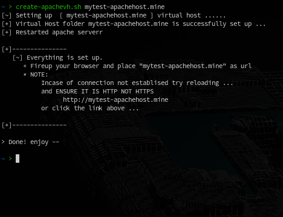

# create-apachevh

Creating virtual host requires knowing which configurations to change and 
update. Which are easy to forget!

`create-apachvh` creates virtual host(s) and updates all relevant files.
All then you have to do is test for the provide link and start working
right away.
Creating virtual host will feel like a breaze.

### Preview

### Commands

- `create-apachevh host.link`

You can specify multiple host as a list of arguments separated by space.

### About

Creates virtual host on arch based systems only, atleast for now.

Requirements : `apache server`

Tested and working on Manjaro Linux.

### Installation

You can add to your local bin folder.
Add execution rights. Then you are goo to go.

- `sudo chmod u+x create-apachevh`

